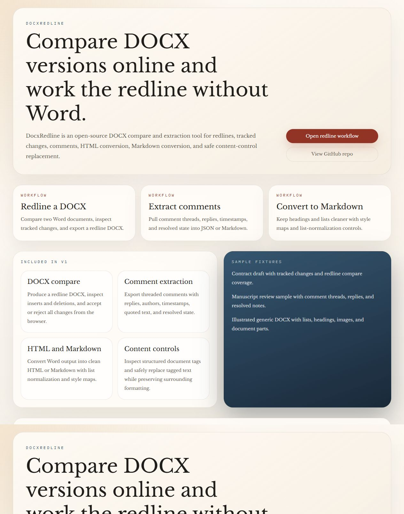
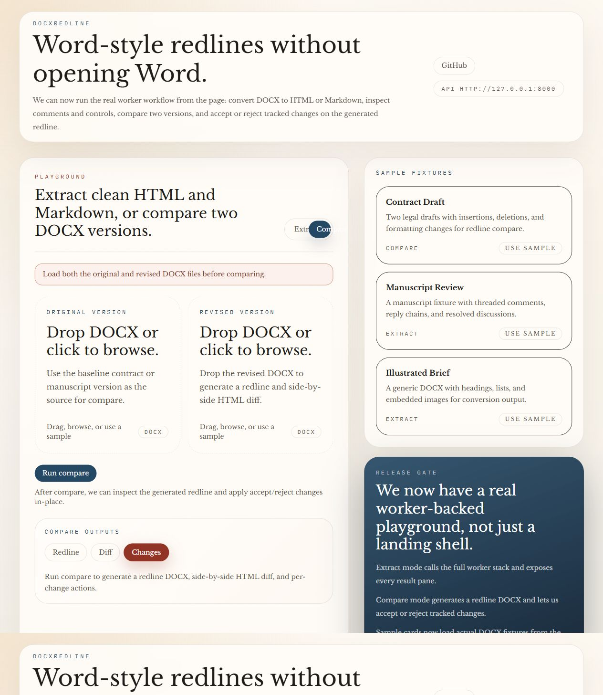

# DocxRedline

DocxRedline is an open-source server-side tool to compare DOCX versions online, accept or reject tracked changes, extract comments, and convert Word documents to clean HTML or Markdown.

## What It Does

- Compare two DOCX files and generate a Word-style redline DOCX.
- Accept or reject tracked changes, either one by one or in bulk.
- Extract comments, replies, timestamps, and resolved state.
- Convert DOCX to clean HTML or Markdown with style-map and list-normalization options.
- Inspect and safely replace structured document tag content controls.
- View headers, footers, footnotes, endnotes, and embedded objects.

## Screenshots




## Workspace

```text
apps/web      Next.js 15 playground
apps/worker   FastAPI worker
packages/*    shared types, UI, and worker helpers
```

## Local Development

### Prerequisites

- Node 22+
- pnpm 10+
- Python 3.12 for the target worker runtime

### Install

```bash
pnpm install
```

### Run The Web App

```bash
pnpm dev:web
```

### Run The Worker

```bash
cd apps/worker
python -m uvicorn --app-dir src docx_redline_worker.main:app --host 127.0.0.1 --port 8000
```

Set `NEXT_PUBLIC_API_BASE_URL=http://127.0.0.1:8000` when running the web app locally on a different port.

## Self-Host With Docker

```bash
docker compose up --build
```

That brings up:

- Web on `http://localhost:3000`
- Worker on `http://localhost:8000`

If those host ports are busy, override them without editing the compose file:

```bash
DOCX_REDLINE_WEB_PORT=3005 DOCX_REDLINE_WORKER_PORT=8011 docker compose up --build
```

## Verification Commands

```bash
pnpm lint
pnpm typecheck
pnpm build
cd apps/worker && python -m pytest
```

## Qualification Commands

```bash
cd apps/web && NEXT_PUBLIC_API_BASE_URL=http://127.0.0.1:8010 pnpm start --hostname 127.0.0.1 --port 4311
pnpm verify:lighthouse -- --url http://127.0.0.1:4311 --output docs/qc-artifacts/lighthouse/local.report.json
pnpm verify:compare -- --base-url http://127.0.0.1:8010 --iterations 7 --target-size-bytes 1048576 --change-interval 400 --output docs/qc-artifacts/compare/local-benchmark.json
```

## Qualification Tracking

- Release gate: `RELEASE_QUALIFICATION_CHECKLIST.md` Section 23
- Working QC appendix: `docs/QC_APPENDIX_B.md`
- Product requirements: `PRODUCT_REQUIREMENTS.md`
